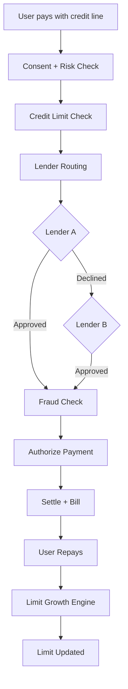
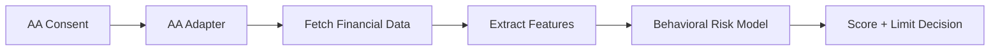

# Consumption Credit

### Instant credit lines on UPI behavior — for prime *and* thin-file users

**Consumption Credit** is a full-stack simulation of a next-generation consumption-credit platform in the same product category as super.money, PhonePe Credit, and bank-led UPI credit lines.

It underwrites both traditional bureau customers and **thin-file / new-to-credit** users by combining Account Aggregator (AA) consent, 9-signal UPI behavioral scoring, multi-lender routing, unified billing, fraud-safe settlement, and repayment-driven limit growth.

<p align="center">
  
  
  
  
</p>

---

## Why this exists

Credit in India is still biased toward bureau-rich customers. Millions of active UPI users remain **thin-file**. This project demonstrates a credible orchestration layer that:

| Problem | What we ship |
| --- | --- |
| Thin-file underwriting | AA consent + 9-signal behavioral risk score |
| Single-lender decline | Multi-lender orchestration with fallback |
| Opaque credit decisions | Credit Health breakdown of every signal |
| Large-ticket fraud risk | Delayed / fraud-safe settlement path |
| Fragmented statements | Unified billing + repayment lifecycle |
| Static limits | Limit Growth Engine after on-time repayments |

> **Every rupee moved is consented, risk-checked, traceable, and governed by a single credit policy.**

---

## Product surface

| Module | What the user can do |
| --- | --- |
| **Onboarding & KYC** | Name, PAN, VPA, live face + fingerprint simulation |
| **Bureau / Thin-file split** | Prime path vs AA alternative underwriting |
| **AA Consent** | Explicit mandate for account discovery & data share |
| **Risk Engine** | Behavioral score (out of 1000) + risk tier |
| **Lenders Marketplace** | Pick NBFC offers matched to unlocked limit tier |
| **Dashboard** | Credit line, utilization, pay, bills, transactions |
| **Credit Health** | Transparent 9-signal score breakdown |
| **Security / Audit** | Consent-first controls and risk logs |

---

## System architecture

### 1. Experience layer
React + Vite UI covering Dashboard, Credit Health, Pay, Transactions, Bills, AA Consent, and Security.

### 2. API & orchestration
REST API gateway with a central **Credit Orchestrator** that routes every money-moving request through consent, risk, limit, lender, fraud, settlement, and audit checks.

### 3. Eleven core services

1. Consent Service  
2. Risk Engine  
3. Credit Line Manager  
4. Lender Router  
5. Payment / Transaction Service  
6. Settlement Service  
7. Billing Service  
8. Repayment Service  
9. Limit Growth Engine  
10. Fraud Guard  
11. Audit Service  

### 4. External adapters
- **Account Aggregator Adapter** — mock AA / sandbox financial data  
- **Lending Adapter** — OCEN-compatible simulated lenders (A / B / C)

### 5. Data & infrastructure (target / documented)
PostgreSQL for durable entities, behavioral risk model outputs, Redis for fast idempotent operations.

See [`ARCHITECTURE.md`](./ARCHITECTURE.md) and [`docs/`](./docs/) for module boundaries and feature contracts.

---

## End-to-end payment flow

1. User pays ₹2,000 using their credit line  
2. Explicit consent + behavioral risk checks run  
3. Available limit / exposure is verified  
4. Lender Router tries Lender A → falls back to Lender B if needed  
5. Fraud constraints pass → payment authorized → settlement  
6. Transaction recorded → unified bill generated → user repays  
7. Limit Growth Engine may raise the limit after healthy repayment behavior  



---

## Account Aggregator & thin-file risk flow

1. User grants AA consent  
2. Adapter fetches synthetic financial ledgers  
3. Risk Engine extracts cash-flow and UPI behavior features  
4. Behavioral model returns score + recommended limit  
5. Marketplace unlocks matching lender offers  



### Nine behavioral signals

1. Transaction Frequency  
2. Transaction Consistency  
3. Bill Payment Regularity  
4. Category Diversity  
5. Average Transaction Value  
6. Cash-Flow Inflows  
7. Cash-Flow Stability  
8. Failed Transaction Rate  
9. Platform Repayments  

---

## Step-by-step user journey

### Step 1 — Onboarding & KYC
Collect profile details and simulate live facial + biometric checks against PAN identity.

### Step 2 — Bureau check
- **Prime path** (score 600+): skip AA, go to lender selection  
- **Thin-file path** (e.g. `thin@ybl`): route to alternative underwriting  

### Step 3 — AA discovery & consent *(thin-file only)*
Discover linked accounts and capture a strict consent mandate (data, purpose, duration).

### Step 4 — Risk assessment
Compute behavioral score / tier from the nine signals above.

### Step 5 — Lenders marketplace
Unlock limit tiers (e.g. ₹5,000 / ₹10,000 / ₹20,000), accept an NBFC offer, provision the line instantly.

### Step 6 — Operate the line
Use Dashboard, Pay, Bills, Transactions, and Credit Health for continuous transparency.

---

## Tech stack

| Layer | Stack |
| --- | --- |
| Frontend | React 18, TypeScript, Vite, Tailwind CSS, React Router, Context API |
| Backend | Node.js, Express, TypeScript, layered controllers/services |
| Domain | Mock AA, rule engines, multi-lender orchestration, BNPL helpers |
| Docs | Architecture, team moto, integration map, 8 feature specs |

---

## Repository layout

```text
.
├── ARCHITECTURE.md          # System design & boundaries
├── README.md                # You are here
├── docs/
│   ├── TEAM_MOTO.md
│   ├── INTEGRATION.md
│   └── features/            # 01–08 module build contracts
├── backend/
│   └── src/                 # AA, risk, consent, VRP-like credit services
└── frontend/
    └── src/                 # Pages, API clients, components, layout
```

---

## Local setup

### Backend

```bash
cd backend
npm install
npm run dev
# http://localhost:3000
```

### Frontend

```bash
cd frontend
npm install
npm run dev
# http://localhost:5173
```

---

## Test personas

Use these VPAs during onboarding to exercise different paths:

| VPA | Behavior |
| --- | --- |
| `thin@ybl` | Thin-file AA path with strong behavioral score |
| `thin-fail@ybl` | Thin-file AA path rejected for poor UPI behavior |
| `existing@super.money` | Prime bureau path (AA skipped) |

---

## Engineering principles

- **SOLID over clever** — one job per class  
- **Interfaces before implementations** — `Lender`, `RiskEngine`, `Settlement` are contracts  
- **Consent & audit are mandatory** — every credit action is traceable  
- **Fail closed** — unverifiable risk/consent means decline, never silent allow  

---

## Documentation map

| Doc | Purpose |
| --- | --- |
| [`ARCHITECTURE.md`](./ARCHITECTURE.md) | End-to-end system design |
| [`docs/TEAM_MOTO.md`](./docs/TEAM_MOTO.md) | Working agreements |
| [`docs/INTEGRATION.md`](./docs/INTEGRATION.md) | How modules wire together |
| [`docs/features/`](./docs/features/) | Feature-level build prompts & designs |

---

## Credits

Product concept and reference implementation inspired by the Super.money-style consumption credit brief. This repository is maintained at [achuth07776/Consumption_Credit](https://github.com/achuth07776/Consumption_Credit).
